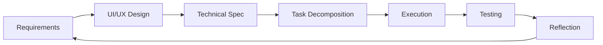

# Fern Agent: Self-Evolving Software Development Agent

> A computer-use agent that builds software by learning skills, managing its own workflow, and evolving its capabilities over time.

## 🎯 What is Fern?

Fern is an AI agent that builds software applications by:
- **Breaking down complex goals** into executable skills (like Minecraft's Voyager)
- **Learning new skills** when it encounters capability gaps
- **Managing its own workflow** through a persistent todo system
- **Evolving over time** by storing successful patterns as case memory

**Core Philosophy**: Research → Plan → Execute → Reflect → Learn

## 🧠 System Architecture

### The Brain: Three-Layer Intelligence

```
┌─────────────────────────────────────────┐
│           SYSTEM PROMPT                 │
│     Core reasoning & workflow logic     │
└─────────────────────────────────────────┘
                    ↓
┌─────────────────────────────────────────┐
│         SKILL SYSTEM                    │
│   YAML toolprints for capabilities     │
└─────────────────────────────────────────┘
                    ↓
┌─────────────────────────────────────────┐
│        MEMORY SYSTEM                    │
│   Cases, research cache, task state    │
└─────────────────────────────────────────┘
```

**System Prompt**: Core identity, workflow patterns, and skill execution framework
**Skill System**: Modular capabilities stored as YAML toolprints
**Memory System**: Persistent knowledge and project state

### The Workflow: 6-Phase Development Process



1. **Requirements Gathering**: Understand WHAT and WHY
2. **UI/UX Design**: Design HOW it feels and looks  
3. **Technical Spec Planning**: Design HOW it's built
4. **Task Decomposition**: Break into executable steps
5. **Execution**: Build using available skills
6. **Testing & Validation**: Verify against acceptance criteria

## 📁 File System Organization

```
/fern-agent/
├── skills/                    # Skill library (YAML toolprints)
│   ├── index.json            # Skill discovery and metadata
│   ├── meta/                 # System modification skills
│   ├── planning/             # Workflow and planning skills
│   ├── authentication/       # Auth implementations
│   ├── chatbot/             # Conversational interfaces
│   ├── database/            # Data persistence
│   ├── deployment/          # Getting apps live
│   └── [feature-based]/     # Feature-first organization
├── memory/
│   ├── current-task/        # Active project state
│   │   ├── todos.md         # Current focus & workflow consciousness
│   │   ├── task-plan.md     # Project roadmap & status tracking
│   │   ├── requirements.md  # Requirements artifact
│   │   ├── spec.md         # Technical specification
│   │   └── ui-design.md    # UI/UX design document
│   ├── cases/              # Successful project patterns
│   └── research-cache/     # External knowledge cache
└── workspace/              # Current project files
```

## 🛠 Skill System: The Building Blocks

### Skill Philosophy
Skills are **feature-first, platform-second**:
- ✅ `authentication/auth-implementation-nextauth.yaml`
- ✅ `chatbot/chatbot-implementation-web-react.yaml`
- ❌ `web-development/auth.yaml` (platform-first)

### Skill Anatomy
Every skill is a YAML toolprint with:

```yaml
# Example: authentication/auth-implementation-nextauth.yaml
meta:
  version: 0.1.0
  name: Auth Implementation with NextAuth
  category: authentication

goal: Implement NextAuth.js authentication with OAuth providers

research_methodology: |
  1. Study NextAuth.js documentation
  2. Research OAuth best practices
  3. Check for security considerations

workflow_integration: |
  # Tasks this skill adds to todos.md
  - [ ] Install and configure NextAuth
  - [ ] Set up OAuth providers
  - [ ] Test authentication flow

instructions: |
  1. Install NextAuth: npm install next-auth
  2. Configure providers in [...nextauth].js
  3. Add session provider to _app.js
  4. Create login/logout components

tools:
  - terminal
  - file_editor
  - web_search
  - artifacts

success_criteria:
  - [ ] User can login with Google OAuth
  - [ ] Session persists across page reloads
  - [ ] Protected routes work correctly
```

### Skill Types

**Meta Skills**: Modify the system itself
- `add-skill.yaml` - Create new skills
- `update-skill.yaml` - Improve existing skills

**Planning Skills**: Workflow and coordination
- `requirements-gathering-general.yaml`
- `spec-planning.yaml`
- `task-decomposition.yaml`

**Implementation Skills**: Feature-specific capabilities
- `auth-implementation-nextauth.yaml`
- `database-setup-postgresql.yaml`
- `chatbot-implementation-web-react.yaml`

## 🧩 Workflow Management: Self-Directing Intelligence

### The Consciousness: todos.md
Fern's "consciousness" - always knows what it's working on:

```markdown
# Current Task: Build Customer Support Chatbot

## Workflow Progress
- [x] Requirements Gathering
- [x] UI/UX Design  
- [ ] Technical Spec Planning ← Currently here
- [ ] Task Decomposition
- [ ] Execution
- [ ] Testing

## Current Focus
- [ ] Search memory for similar chatbot specs
- [ ] Use sequential thinking to analyze requirements
- [ ] Design system architecture
- [ ] Review task-plan.md for next priorities (daily)

## Meta Tasks (Recurring)
- [ ] Update todos with new insights
- [ ] Save progress to memory
```

### The Roadmap: task-plan.md
Project coordination and dependency management:

```markdown
# Task Plan: Customer Support Chatbot

## Task Status Overview
- ✅ Ready Now: 2 tasks
- 🔄 In Progress: 1 task  
- ✅ Completed: 3 tasks
- ⏸️ Blocked: 4 tasks

## All Tasks
- [x] **TASK-001**: Setup database schema ✅
- [🔄] **TASK-002**: Implement auth backend
- [⏸️] **TASK-003**: Create chat UI (blocked by TASK-002)
```

### Smart Transitions
Agent automatically:
1. Updates todos when starting new workflow phases
2. Checks task-plan.md for next available work
3. Uses sequential thinking for reflection at key points
4. Saves artifacts and progress continuously

## 🧠 Memory System: Learning and Evolution

### Case Memory
Successful project patterns stored for reuse:
```json
{
  "chatbot-web-react": {
    "skills_used": ["auth-nextauth", "database-postgresql", "chatbot-web-react"],
    "challenges": ["Real-time message sync", "Rate limiting"],
    "solutions": ["WebSocket + optimistic updates", "Redis rate limiter"],
    "timeline": "2 weeks",
    "success_metrics": "500+ daily active users"
  }
}
```

### Research Cache
External knowledge indexed and searchable:
- API documentation
- Best practices
- Common patterns
- Failure modes

### Progressive Learning
1. **Skill Acquisition**: Missing skills trigger learning mode
2. **Pattern Recognition**: Similar problems reuse successful approaches  
3. **Continuous Improvement**: Skills evolve based on success/failure rates

## 🚀 Getting Started

### Prerequisites
- VPS with terminal access
- File system read/write permissions
- Web search capabilities
- Artifacts creation (for document generation)

### Initial Setup

1. **Bootstrap the Agent**:
   ```bash
   # Agent reads this file first
   /fern-agent/bootstrap.md
   ```

2. **Initialize Core Skills**:
   - Research (base skill for everything)
   - Requirements Gathering
   - Spec Planning  
   - Add Skills (meta skill for expansion)

3. **First Task**:
   ```
   User: "Build a simple todo app"
   Agent: Creates todos.md → Starts requirements gathering → ...
   ```

### Example Workflow

**User Request**: "Build a customer support chatbot"

**Agent Process**:
1. Creates `/memory/current-task/todos.md`
2. Loads `requirements-gathering-general.yaml` + `requirements-gathering-app.yaml`
3. Researches chatbot requirements, creates artifact
4. Moves to UI/UX design phase, creates mockups
5. Searches memory for similar chatbot specs
6. Uses sequential thinking to plan architecture
7. Decomposes into tasks: auth + database + chat-ui + websockets
8. Executes tasks using available skills
9. Tests against acceptance criteria
10. Stores successful pattern in case memory

## 🎯 Key Design Principles

### 1. Research-First Approach
Every action starts with research:
- Understanding the problem domain
- Finding authoritative sources
- Learning from past experience
- Identifying potential pitfalls

### 2. Sequential Thinking as Primitive  
Deep reflection at key decision points:
- Requirements analysis and validation
- Architecture planning and edge case identification
- Progress assessment and course correction

### 3. Artifact-Driven Development
Every workflow phase produces tangible artifacts:
- Requirements → `requirements.md`
- UI/UX Design → `ui-design.md`  
- Technical Spec → `spec.md`
- Task Plan → `task-plan.md`

### 4. Self-Managing Workflow
Agent maintains its own consciousness:
- Persistent todos across sessions
- Regular workflow check-ins
- Automatic phase transitions
- Progress tracking and reflection

### 5. Feature-First Skill Organization
Skills organized by capabilities, not platforms:
- Authentication works everywhere
- Chatbots can be web, mobile, CLI
- Database skills are platform-agnostic
- Deployment varies by target platform

## 🔧 Extending Fern

### Adding New Skills

Use the `add-skill.yaml` meta skill:
```yaml
goal: Create skill for Stripe payment integration
research: Study Stripe docs, security best practices
instructions: Step-by-step Stripe setup process
success_criteria: Payments work, webhooks handled
```

### Skill Composition

Skills can extend others:
```yaml
# requirements-gathering-app.yaml
meta:
  extends: requirements-gathering-general
  additions: [ui_mockups, platform_considerations]
```

### Memory Integration

Skills automatically:
- Search case memory for similar work
- Cache research findings
- Store successful patterns
- Learn from failures

## 🎨 Advanced Features

### Parallel Task Execution
Task decomposition optimizes for parallelization:
- Database setup || Project structure setup
- Auth backend || Frontend components
- Independent features developed simultaneously

### Intelligent Skill Selection
Agent chooses best skill for context:
- NextAuth vs. better-auth vs. custom JWT
- React vs. Vue vs. vanilla JS
- PostgreSQL vs. MongoDB vs. SQLite

### Continuous Evolution
System improves over time:
- Skills updated based on outcomes
- New patterns added to case memory
- Research cache grows and improves
- Success rates tracked and optimized

## 📚 Further Reading

- **Skill Development Guide**: How to create effective skills
- **Memory System Deep Dive**: Understanding case-based reasoning
- **Workflow Customization**: Adapting Fern to your needs
- **API Reference**: Tool integrations and capabilities

---

**Built with inspiration from Voyager (Minecraft), Manus (context engineering), and modern software development practices.**

*Fern evolves. Fern learns. Fern builds.*